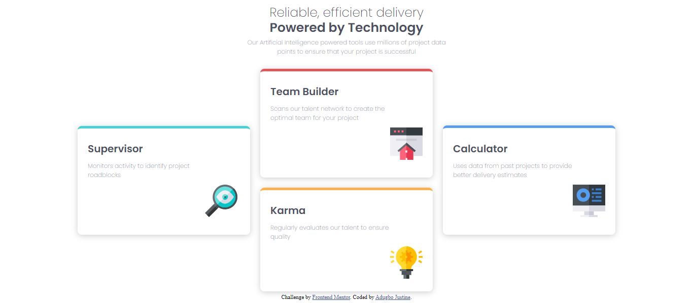

# Frontend Mentor - Four card feature section solution

This is a solution to the [Four card feature section challenge on Frontend Mentor](https://www.frontendmentor.io/challenges/four-card-feature-section-weK1eFYK). Frontend Mentor challenges help you improve your coding skills by building realistic projects. 

## Table of contents

- [Overview](#overview)
  - [The challenge](#the-challenge)
  - [Screenshot](#screenshot)
  - [Links](#links)
- [Author](#author)

## Overview

### The challenge

Users should be able to:

- View the optimal layout for the site depending on their device's screen size

### Screenshot

### Links

- Solution URL: [https://www.frontendmentor.io/challenges/four-card-feature-section-weK1eFYK/solutions/new](https://www.frontendmentor.io/challenges/four-card-feature-section-weK1eFYK/solutions/new)
- Live Site URL: [https://justine1285.github.io/Responsive-landing-layout-using-css-flexbox/](https://justine1285.github.io/Responsive-landing-layout-using-css-flexbox/)

## My process

### Built with

- Semantic HTML5 markup
- CSS custom properties
- Flexbox
- CSS Grid

## Author

- Frontend Mentor - [@justine1285](https://www.frontendmentor.io/profile/justine1285)
- Twitter - [@justine_mamus](https://www.twitter.com/justine_mamus)

